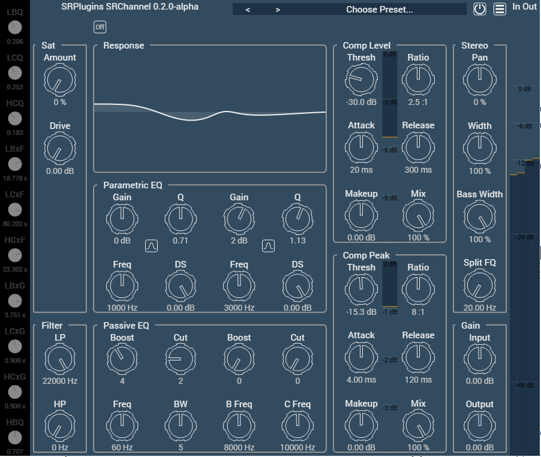

# SRPlugins
New attempt to programm VST Plugins with Oli Larkins IPlug2 framework.

Here is a screenshot of what I'm trying to achieve:


## Dependencies
- Python (Don't forget to tick the box to add python to your environment variable)

## Build
Work in progress...

### Clone Repository
```
git clone --recursive https://github.com/johannesmenzel/SRPlugins.git
```

### Iplug build dependencies
```
cd SRPlugins/Iplug2/Dependencies/Iplug
./download-iplug-sdks.sh
cd ..
./download-prebuilt-libs.sh
cd ../Scripts
python select_host.py

```
### Access Rights to VST3 folder

Navigate to C:\Program Files\Common Files\VST3 in explorer and right click, selecting "Properties". On the "Security" tab, give the group "Users" full control. Hopefully now you can build the VST3 project and it will launch Reaper, loading a project including the plug-in.

### Build Project
Open projects *.sln and unload unused targets (typically all except vst3)
